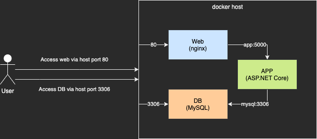

# SRE Exercise

## The deployment diagram of the exercise



## The instructions to setup the exercise

### Run with docker compose

Open the terminal and run the following command:

```bash
docker-compose up
```

Open another terminal and validate the container instances with the following command:

```bash
docker ps --format '{{.Names}}'
sre-exercise-web-1
sre-exercise-app-1
sre-exercise-mysql-1
```

### Create admin user to MySQL

Get into container bash

```bash
docker exec -it sre-exercise-mysql-1 /bin/bash
```

Login MySQL Server with the password `123456`

```bash
mysql -u root -p
```

Create an Admin User with DBA permissions

```sql
CREATE USER 'admin'@'%' IDENTIFIED BY '123456';
GRANT ALL PRIVILEGES ON *.* TO 'admin'@'%';
FLUSH PRIVILEGES;
```

Finally, exit the bash of sre-exercise-mysql-1

P.s. The password is very weak because of exercise purpose, remember to use strong password in production.

### Import database for simple RESTful API

Import the database schema

```bash
mysql -h 127.0.0.1 -u admin -p < db-scripts/sre_exercise.sql
```

### Import the sample DB into MySQL

Clone the sample DB git repository to local

```bash
git clone https://github.com/datacharmer/test_db.git
```

Import the sample DB

```bash
cd test_db
mysql -h 127.0.0.1 -u admin -p < employees.sql
```

Validate the sample DB

```bash
mysql -h 127.0.0.1 -u admin -p -t < test_employees_sha.sql
```

If the validation passes, the configuration is completed and the DB is ready.

### Add custom FQDN to host file

Add the following record to the host file `/etc/hosts`:

```
127.0.0.1   smartclouds.site
```

## Access the website

Open the web browser with the following URL:

```
http://smartclouds.site/
```

## Access the RESTful API documentation

Open the web browser with the following URL:

```
http://smartclouds.site/swagger/index.html
```

The RESTful API Server used the API Key to authenticate the access, you can pass the authentication by the HTTP Header `X-ApiKey` with the value `528f31009c0d4af99dad2b00249ee266`.

## Backup the database with the requirement

The usage of the backup script:

```bash
# usage
db-scripts/db-backup.sh <host> <username> <password> <output-dir>

# example
db-scripts/db-backup.sh 127.0.0.1 admin 123456 backup/
```